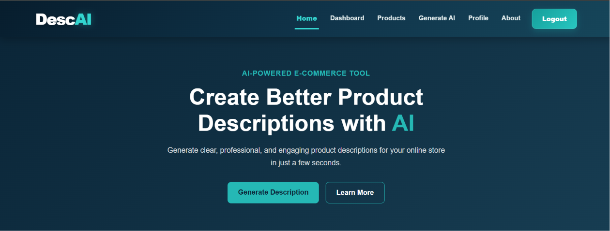
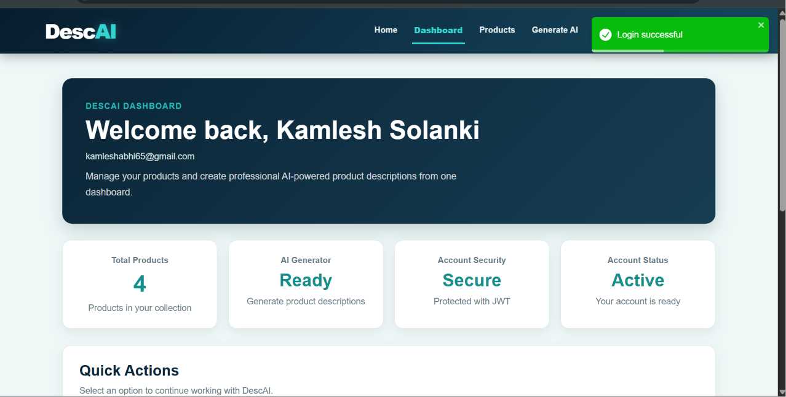
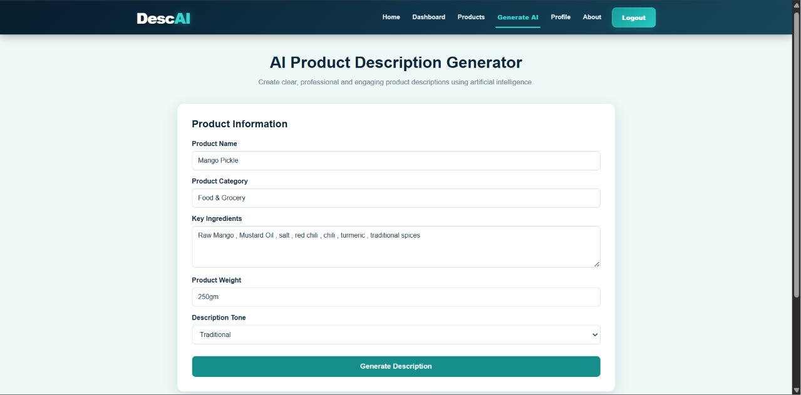
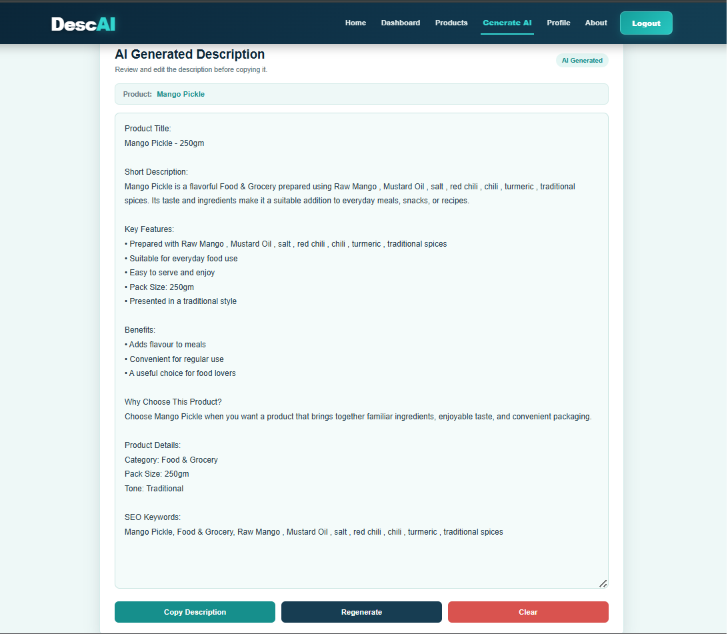

# DescAI – AI Product Description Generator

DescAI is a full-stack AI-powered web application that helps users create clear, engaging, and professional product descriptions for e-commerce platforms.

Users can enter product information such as product name, category, key ingredients, product weight, and preferred writing tone. The application generates an AI-based product description that users can review, edit, regenerate, and copy.

---

## Live Demo

### Frontend Application

**Live Application:**  
https://descai-frontend.onrender.com

### Backend API

**Backend API:**  
https://descai-backend.onrender.com

### GitHub Repository

**Source Code:**  
https://github.com/Anshuman0706/SIP_PROJECT.git

---

## Project Features

### User Authentication

- User registration
- User login
- JWT-based authentication
- Protected user profile
- Google OAuth login
- Forgot password functionality
- Password reset using a secure reset token
- Password encryption using bcrypt

### AI Product Description Generator

- Enter product name
- Enter product category
- Add key ingredients or important product information
- Enter product weight
- Select a preferred writing tone
- Generate an AI-based product description
- Edit the generated description
- Regenerate the description
- Copy the final description
- Clear the generated output
- Fallback description generation when the Gemini API is unavailable

### Product Management

- Add new products
- View saved products
- Search products
- Edit product details
- Delete products
- Store product information using MongoDB Atlas

### User Interface

- Responsive user interface
- Dark blue and teal color theme
- Desktop and mobile-friendly layout
- User-friendly validation messages
- Loading indicator during AI generation
- Toast notifications
- Error handling for AI generation and API issues

---

## Screenshots

### Home Page



### Login Page



### AI Product Description Generator



### Generated Product Description



---

## Tech Stack

### Frontend

- React
- TypeScript
- Vite
- React Router
- Axios
- Bootstrap
- React Icons
- React Toastify

### Backend

- Node.js
- Express.js
- MongoDB
- Mongoose
- JSON Web Token (JWT)
- bcryptjs
- Passport.js
- Google OAuth
- Express Validator
- Express Rate Limit
- Nodemailer
- Crypto
- CORS
- Express Session

### AI Integration

- Google Gemini API
- `@google/genai`

### Database

- MongoDB Atlas

### Deployment

- Render

---

## Project Architecture

```text
                         DescAI
                           |
             +-------------+-------------+
             |                           |
        Frontend                      Backend
             |                           |
     React + TypeScript          Node.js + Express
             |                           |
             +-------------+-------------+
                           |
                     MongoDB Atlas
                           |
                    Google Gemini API
```

---

## Project Structure

```text
react-app/
│
├── backend/
│   ├── config/
│   ├── controllers/
│   ├── data/
│   ├── middleware/
│   ├── models/
│   ├── routes/
│   ├── services/
│   ├── .env
│   ├── .env.example
│   ├── .gitignore
│   ├── listModels.js
│   ├── package.json
│   ├── server.js
│   └── test.js
│
├── src/
│   ├── api/
│   │   ├── ai.ts
│   │   └── auth.ts
│   │
│   ├── assets/
│   ├── components/
│   │
│   ├── Pages/
│   │   ├── About.tsx
│   │   ├── Dashboard.tsx
│   │   ├── ForgotPassword.tsx
│   │   ├── GenerateDescription.tsx
│   │   ├── GoogleSuccess.tsx
│   │   ├── Home.tsx
│   │   ├── Login.tsx
│   │   ├── Products.tsx
│   │   ├── Profile.tsx
│   │   ├── Register.tsx
│   │   └── ResetPassword.tsx
│   │
│   ├── App.css
│   ├── App.tsx
│   ├── Hero.tsx
│   ├── index.css
│   ├── main.tsx
│   ├── message.tsx
│   └── vite-env.d.ts
│
├── public/
├── screenshots/
├── package.json
└── README.md
```

---

## Installation and Setup

### Prerequisites

- Node.js
- npm
- MongoDB Atlas account
- Google Gemini API key

### 1. Clone the Repository

```bash
git clone https://github.com/Anshuman0706/SIP_PROJECT.git
cd react-app
```

### 2. Install Frontend Dependencies

From the project root:

```bash
npm install
```

### 3. Install Backend Dependencies

Open a new terminal and move to the backend folder:

```bash
cd backend
npm install
```

### 4. Configure Environment Variables

Create a `.env` file inside the `backend` folder.

Configure the required environment variables for:

- MongoDB Atlas
- JWT authentication
- Google OAuth
- Google Gemini API
- Email/password reset functionality

Keep sensitive credentials inside the `.env` file.

Do not upload the `.env` file to GitHub.

### 5. Start the Backend

Inside the `backend` folder, run:

```bash
npm run dev
```

The backend runs locally on:

```text
http://localhost:5000
```

### 6. Start the Frontend

Open another terminal and return to the project root:

```bash
cd ..
npm run dev
```

Vite will display the local frontend URL in the terminal.

---

## Usage

1. Open the DescAI application.
2. Register a new account or log in.
3. Open the AI Product Description Generator.
4. Enter the product name.
5. Enter the product category.
6. Add ingredients or important product information.
7. Enter the product weight.
8. Select the preferred description tone.
9. Click **Generate Description**.
10. Review and edit the generated description.
11. Regenerate the description if required.
12. Copy the final description.

---

## AI Description Generation Flow

```text
User
  ↓
Product Information
  ↓
React + TypeScript Frontend
  ↓
Node.js + Express Backend
  ↓
Google Gemini API
  ↓
Generated Product Description
  ↓
Review / Edit / Regenerate
  ↓
Copy Final Description
```

---

## Deployment

The application is deployed using Render.

### Frontend

https://descai-frontend.onrender.com

### Backend

https://descai-backend.onrender.com

### Database

MongoDB Atlas is used as the cloud database.

### AI Service

Google Gemini API is used for AI-powered product description generation.

---

## Security

- JWT-based authentication is used for protected functionality.
- Passwords are encrypted using bcryptjs.
- Protected API routes require authentication.
- Express Validator is used for input validation.
- Express Rate Limit is used for API rate limiting.
- Sensitive credentials are stored in environment variables.
- `.env` files should not be committed to GitHub.

---

## Known Limitations

- AI description generation depends on the availability and usage limits of the Google Gemini API.
- Generated descriptions should be reviewed before being published on an e-commerce platform.
- Internet connectivity is required for the deployed application.
- A fallback description is used when the Gemini API is unavailable.

---

## Future Scope

- Add more writing tones and styles.
- Improve product-specific AI recommendations.
- Add more e-commerce-specific description formats.
- Add product image support.
- Add export options for generated descriptions.
- Further improve the quality of AI-generated descriptions.

---

## Credits

- Google Gemini API for AI-powered product description generation.
- MongoDB Atlas for cloud database hosting.
- Render for application deployment.
- React and Node.js ecosystem used for application development.